# PneumoDetectAI - AI-Powered Pneumonia Detection

PneumoDetectAI is a full-stack web application designed to assist in the preliminary identification of pneumonia. Leveraging a powerful deep learning model, it analyzes user-uploaded chest X-ray images to provide a potential classification, alongside a suite of features including user authentication and detection history.

---

## Features

* **AI-Powered Detection**: Utilizes a highly accurate Machine Learning model to classify chest X-ray images as either Normal or Pneumonia.
* **Secure User Authentication**: Complete user management system with signup, login, and email verification.
* **Interactive Dashboard**: A user-friendly dashboard to manage your profile and view detection history.
* **Guest Mode**: Try out the pneumonia detection model without creating an account.

---

## Model, Accuracy & Dataset

The core of this project is a Convolutional Neural Network (CNN) fine-tuned for pneumonia classification.

* **Model**: A custom CNN model built with TensorFlow/Keras.
* **Accuracy**: Achieved **95%+** accuracy on the test dataset.
* **Dataset**: The model was trained on the "Chest X-Ray Images (Pneumonia)" dataset available on Kaggle. You can find it here:
    * [https://www.kaggle.com/datasets/paultimothymooney/chest-xray-pneumonia](https://www.kaggle.com/datasets/paultimothymooney/chest-xray-pneumonia)
* **Detected Condition**: The model is trained to identify the following condition:
    1.  Pneumonia
    2.  Normal (No Pneumonia Detected)

---

## Technology Stack

* **Frontend**: React JS
* **Backend**: FastAPI (Python)
* **Machine Learning**: TensorFlow / Keras
* **Database**: MongoDB

---

## 📸 Application Screenshots

### Homepage Layouts
| Home                               | Get Started                               |
| :----------------------------------- | :----------------------------------- |
| 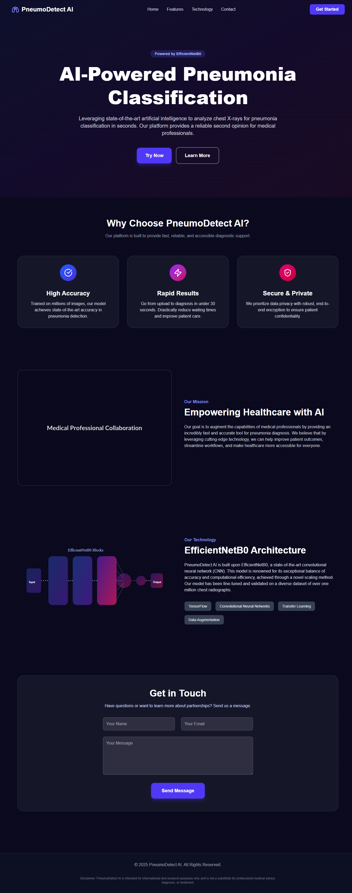       | 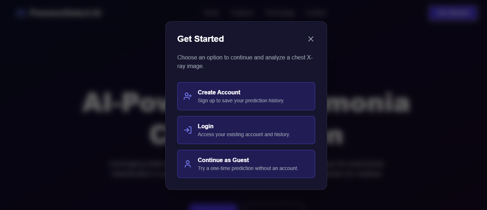       |

### Authentication Flow
| Signup Page                           | Signup Error                            | Email Verification                       |
| :----------------------------------- | :------------------------------------- | :--------------------------------------- |
| 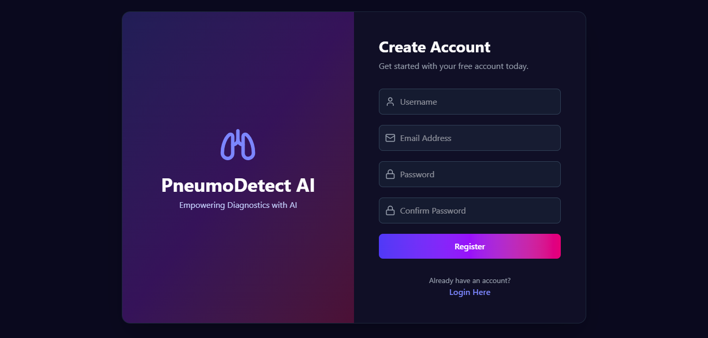         | 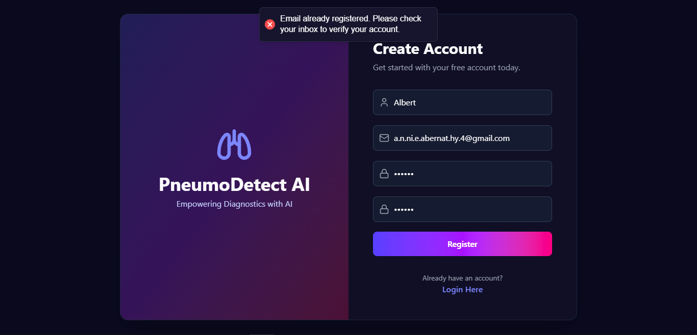       | 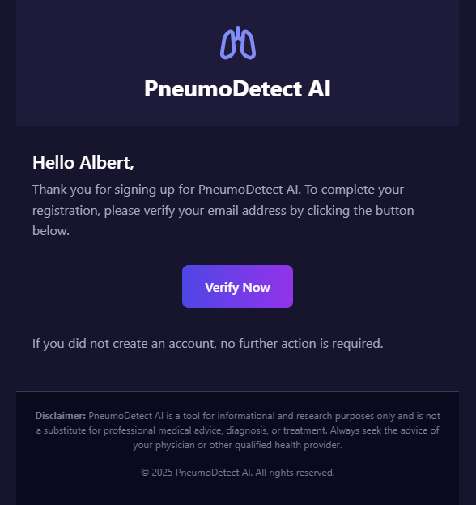      |

| Login Page                          |
| :----------------------------------- |
| 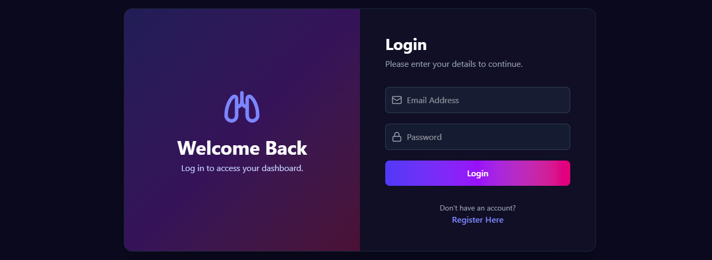 |

### User & Guest Views
| Guest Mode                          | Guest Mode with Pneumonia Result                            | Guest Mode with Normal Result                            |
| :----------------------------------- | :------------------------------------- | :--------------------------------------- |
| 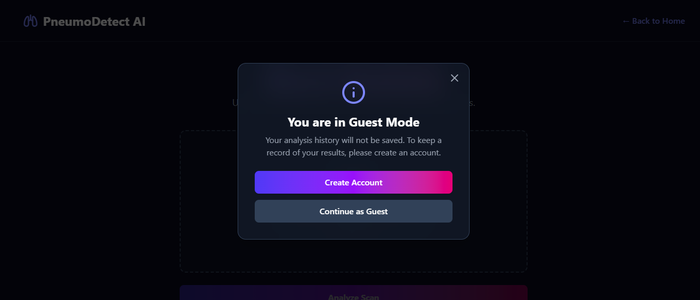 | 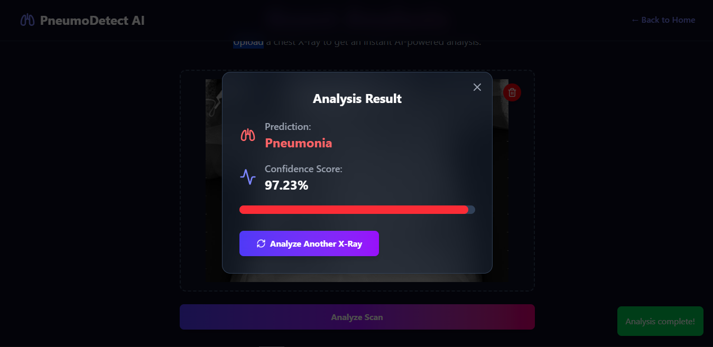 | 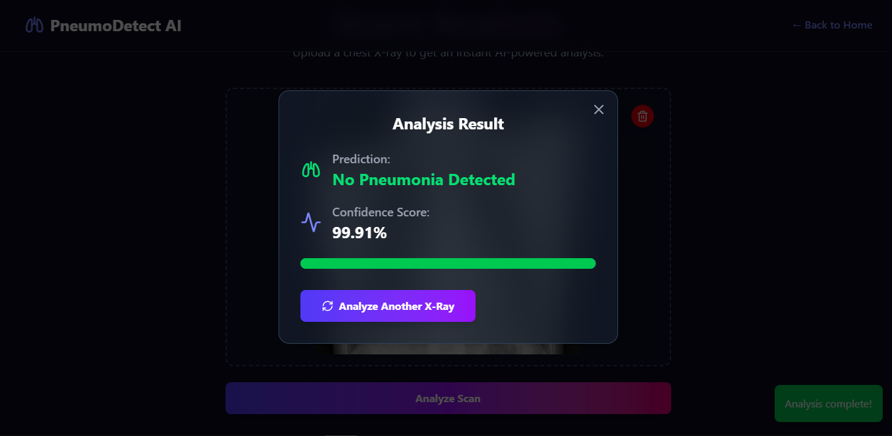     |
| **Dashboard** | **Dashboard with Pneumonia Result** | **Dashboard with Normal Result** |
| 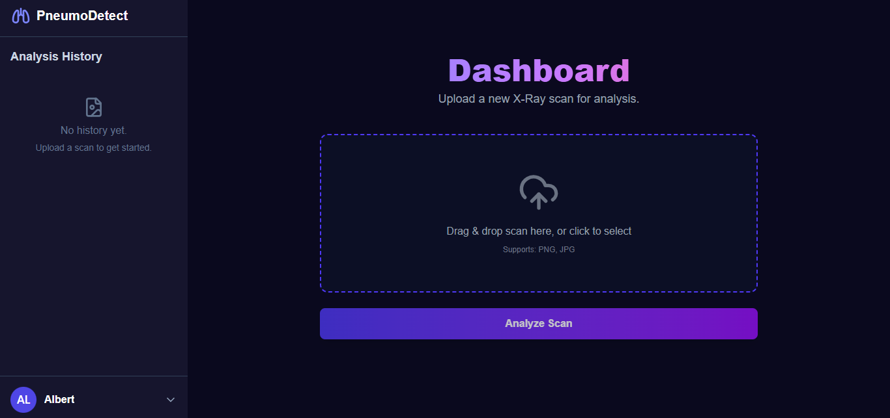     | 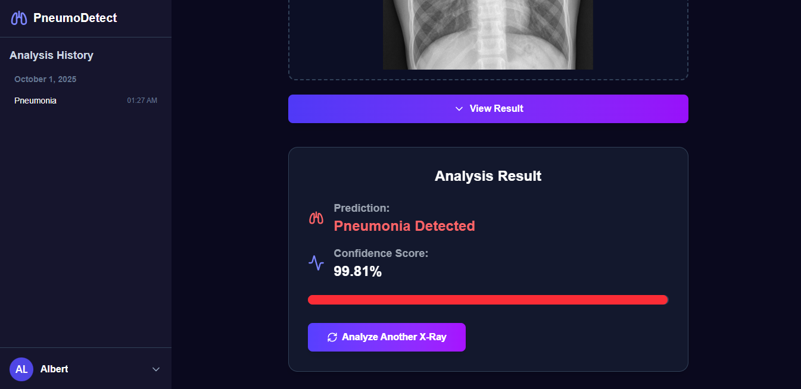       | 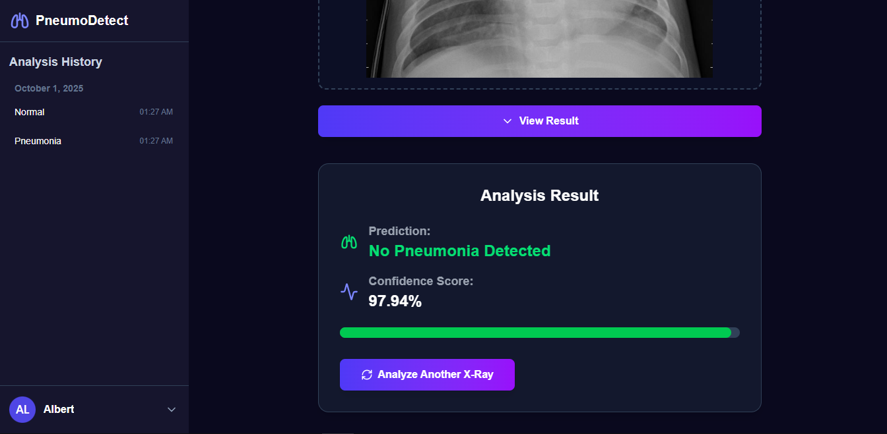         |
| **Dashboard with Logout** | **Logout Successful Notification** |
| 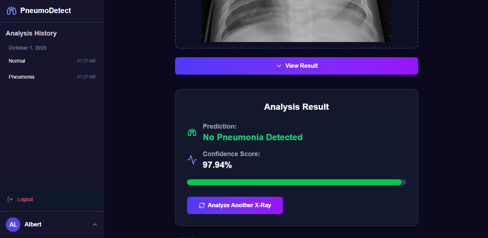 | 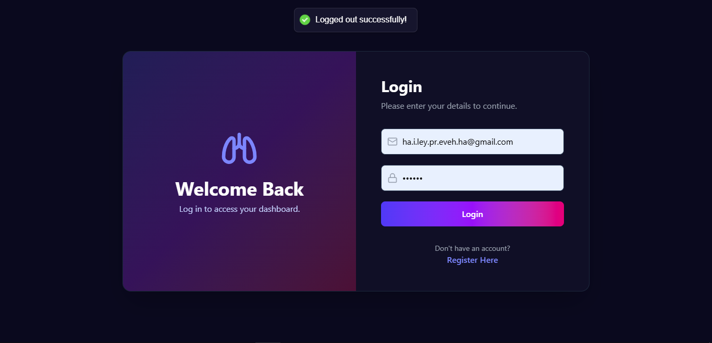 |

---


## 🚀 Installation and Setup

To get a local copy up and running, follow these steps. This project is split into a `backend` and `frontend` directory.

### Prerequisites
* Python 3.8+
* Node.js v14+
* NPM or Yarn

### 1. Clone the Repository
```bash
git clone https://github.com/MHuzaifaHussain/PneumoDetectAI.git
cd PneumoDetectAI
```

### 2.. Frontend Setup (React)

```bash
# Navigate to the frontend directory from the root folder
cd Frontend/pneumo-detect-frontend

# Install NPM packages
npm install

# Start the application
npm run dev
```
The React development server will open at http://localhost:5173.

### 3. Backend Setup (FastAPI)
```bash
# Navigate to the backend directory
cd Backend

# Create a virtual environment
python -m venv venv
source venv/bin/activate  # On Windows use `venv\Scripts\activate`

# Install required Python packages
pip install -r requirements.txt

# Run the backend server
uvicorn app.main:app --reload
```

The backend API will be running on http://127.0.0.1:8000.

### 4. Running the Application

After the initial setup is complete (cloning, virtual environment, and node modules installation), you can easily run the application using the Run.cmd file.

``` bash
# From the root directory of the project
./Run.cmd
```